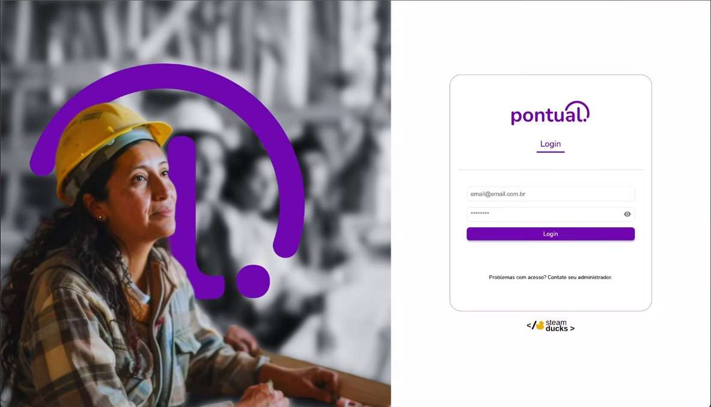

# Carlos Daniel Alves dos Santos

## Introdução
Desenvolvedor Full Stack, atualmente cursando Tecnólogo em Banco de Dados na
FATEC São José dos Campos. Tenho experiência em projetos utilizando Java, PHP,
Laravel, Spring Boot, Vue.js, PostgreSQL, MySQL, Oracle e autenticação com JWT. Atuo com
foco em boas práticas de desenvolvimento, versionamento com Git/GitHub e qualidade
de código.

## Contatos

## Meus Principais Conhecimentos

- Desenvolvimento Back-End: Java (Spring Boot), PHP (Laravel), .NET/C#, autenticação JWT e construção de APIs RESTful.

- Banco de Dados: Modelagem e desenvolvimento com MySQL, PostgreSQL e Supabase.

- Desenvolvimento Front-End: Vue.js, JavaScript e TypeScript.

- Controle de Versão e Colaboração: Git e GitHub, integração em times ágeis com Scrum e Kanban.

- Boas Práticas: Testes (JUnit), qualidade de código, usabilidade, desempenho e escalabilidade.

- Ferramentas de Apoio: IntelliJ IDEA, Visual Studio, VS Code, MySQL Workbench, PgAdmin, DataGrip e Jira.

# Projetos

## Em 2025-1 (3º Semestre)

Projeto desenvolvido para empresa parceira Altave, empresa com foco em monitoramento inteligente de grandes áreas através de videomonitoramento e inteligência artificial.
\
\
O objetivo do projeto foi criar uma aplicação web que permita o monitoramento de funcionários de empresas terceiras em uma determinada área de manutenção.
\
\
Foi entregue um sistema completo com capacidade de gerenciar os funcionarios cadastrados, as empresas, os usarios do sistema e os registros de ponto dos funcionarios, além da funcionalidade de exportar relatorios.

[REPOSITÓRIO](https://github.com/Steam-Ducks/point-system)

### Tecnologias Utilizadas

- **Java** - Linguagem utilizada para o desenvolvimento do back-end do projeto.
- **SpringBoot** - Framework Java utilizado para a construção do back-end da aplicação Web
- **Vue.Js** - Framework utilizado para o desenvolvimento da interface do sistema.
- **PostgreSQL** - SGBD utilizado para gerenciar o banco de dados
- **Supabase** - Serviço de nuvem utilizado para hospedar o banco de dados
- **Figma** - Utilizado na etapa de design para prototipagem e validação das telas.
- **Git** - Ferramenta de controle de versão e colaboração em equipe, mantendo o histórico de alterações do código.
- **GitHub** - Plataforma onde o repositório do projeto foi hospedado.
### Contribuições Pessoais

**Banco de Dados:**

Fui responsável por toda a modelagem e estruturação do banco de dados, abrangendo:

- Criação do modelo Entidade-Relacionamento (ER) para representar de forma clara as entidades, atributos e relacionamentos do sistema.

- Implementação do “esqueleto” do banco de dados, definindo as tabelas, chaves primárias e estrangeiras, e restrições de integridade.

- Manutenção evolutiva do banco, incluindo alterações estruturais (adição, remoção e modificação de colunas e relacionamentos) conforme as novas demandas do projeto.

- Garantia da consistência e normalização dos dados, assegurando desempenho adequado para as operações do sistema.

**Documentação :**

Atuei como Product Owner ao longo do desenvolvimento, sendo o principal ponto de contato entre a equipe técnica e o cliente. Minhas responsabilidades incluíram:

- Levantamento e refinamento de requisitos junto ao cliente, convertendo as necessidades do negócio em requisitos técnicos claros e priorizados.

- Criação e manutenção do Backlog do Produto, com User Stories bem definidas e priorizadas segundo o valor de negócio e complexidade técnica.

- Definição e documentação dos critérios de DoD (Definition of Done) e DoR (Definition of Ready) para padronizar as entregas e garantir qualidade no fluxo de desenvolvimento.

- Acompanhamento das sprints, ajudando a equipe a compreender o escopo e os objetivos de cada ciclo.

**Front-end :**

Contribuí para o desenvolvimento das interfaces administrativas do sistema, com foco na experiência do usuário e integração com a camada de negócios. As principais entregas foram:

- Criação das telas de Gerenciamento de Cargos e Gerenciamento de Empresas, incluindo funcionalidades de listagem, edição e exclusão de registros.

- Desenvolvimento dos modais de cadastro, com tratamento de validações e feedbacks visuais ao usuário.

- Implementação de padrões visuais e estruturais visando manter consistência entre os módulos da aplicação.

- Integração com o back-end através de requisições assíncronas (AJAX / API REST) para manipulação dos dados.

**Back-end :**

No back-end, concentrei meus esforços tanto na qualidade do código quanto na robustez da lógica de negócio. As principais atividades realizadas foram:

- Desenvolvimento do módulo de registro de ponto, abrangendo toda a lógica de armazenamento, validação e regras de negócio.

- Implementação de testes unitários utilizando JUnit, cobrindo as classes de Service e Controller para garantir o correto funcionamento das funcionalidades isoladas.

- Criação de testes de integração para as camadas de Repository e Service, validando a comunicação entre as diferentes partes do sistema.

- Otimização de consultas e melhorias de performance em trechos críticos do código.

**Versionamento :**

Fui responsável pela organização e manutenção do repositório do projeto no GitHub, garantindo boas práticas de versionamento e integração contínua.

- Gerenciamento de branches, adotando fluxos de trabalho padronizados (ex.: feature branches, hotfix, release).

- Revisão de Merge Requests, assegurando a qualidade do código antes da integração na branch principal (main).

- Resolução de conflitos e controle de versões para evitar retrabalho e perda de histórico.

- Padronização das mensagens de commit e acompanhamento das melhores práticas de versionamento colaborativo.

### Hard Skills

- **Vue.JS** - Domínio no desenvolvimento de componentes reutilizáveis e layouts escaláveis, com foco na experiência do usuário (UX) e organização modular do código. Apliquei boas práticas de componentização, reutilização de lógica e padronização de estilos, garantindo interfaces consistentes e de fácil manutenção. Experiência na integração com APIs REST e uso de reatividade e ciclo de vida dos componentes para otimizar o desempenho da aplicação.

- **Java** - Aplicação consistente dos princípios da Programação Orientada a Objetos (POO), incluindo herança, polimorfismo, encapsulamento e abstração. Desenvolvimento de código limpo e estruturado, com foco em boas práticas, padronização de arquitetura e clareza na manutenção. Utilização da linguagem em conjunto com frameworks e bibliotecas modernas do ecossistema Java para construção de soluções robustas e seguras.

- **SpringBoot** - Experiência na criação de APIs RESTful completas, desde o mapeamento de entidades até a implementação das camadas Controller, Service e Repository. Realização de integrações com o banco de dados via JPA/Hibernate, injeção de dependência, e tratamento de exceções. Configuração de testes automatizados, documentação de endpoints e aplicação de boas práticas de arquitetura em projetos back-end baseados em Spring Boot.

- **SQL** - Responsável pela modelagem, manutenção e administração do banco de dados do sistema, hospedado em ambiente cloud (Supabase). Desenvolvimento de scripts SQL, views, triggers e rotinas de integridade referencial. Execução de consultas otimizadas e ajustes em relacionamentos entre tabelas conforme a evolução do projeto. Garantia da coerência e consistência dos dados, além de melhorias contínuas na estrutura do banco.

- **Git** - Gerenciamento completo do versionamento do projeto, utilizando submódulos para separar o back-end e o front-end de forma organizada. Controle de branches conforme boas práticas (main, develop, feature, hotfix), além de análise e revisão de pull requests, resolução de conflitos de merge e padronização dos commits. Adoção de um fluxo de versionamento colaborativo para garantir estabilidade, rastreabilidade e integração contínua entre as partes do sistema.

### Soft Skills

- **Comunicação** - Capacidade de estabelecer uma comunicação clara e objetiva com o cliente, realizando o alinhamento de requisitos do produto e traduzindo essas informações para a equipe técnica. Atuei como elo entre cliente e equipe, garantindo que todos os envolvidos compreendessem o escopo, as prioridades e as mudanças durante o desenvolvimento.

- **Trabalho em equipe** - Participação ativa na colaboração entre os membros da equipe, promovendo o compartilhamento de conhecimento técnico e a divisão equilibrada das responsabilidades. Atuei de forma cooperativa, contribuindo para a resolução de problemas e para o avanço coletivo do projeto.

- **Priorização de Tarefas** - Experiência na identificação e priorização de demandas essenciais para o funcionamento do sistema, com foco nas funcionalidades indispensáveis à entrega do MVP (Produto Mínimo Viável). Capacidade de avaliar impacto, urgência e valor de negócio para definir a sequência ideal de execução das tarefas.

- **Gestão de Pessoas** - Apoiei o time na distribuição de tarefas, acompanhamento de progresso e gestão de conflitos, buscando sempre manter o equilíbrio entre prazos, qualidade e engajamento. Promovi um ambiente colaborativo e orientado a resultados, favorecendo a produtividade e o alinhamento entre os membros da equipe.

