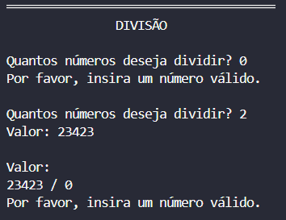
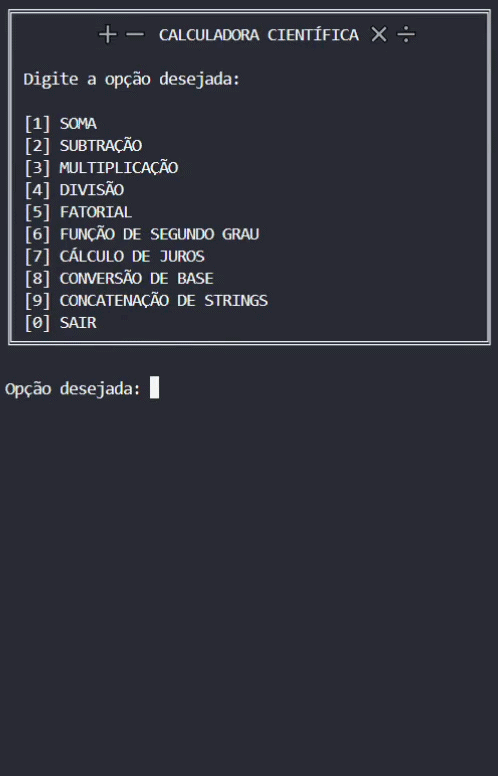
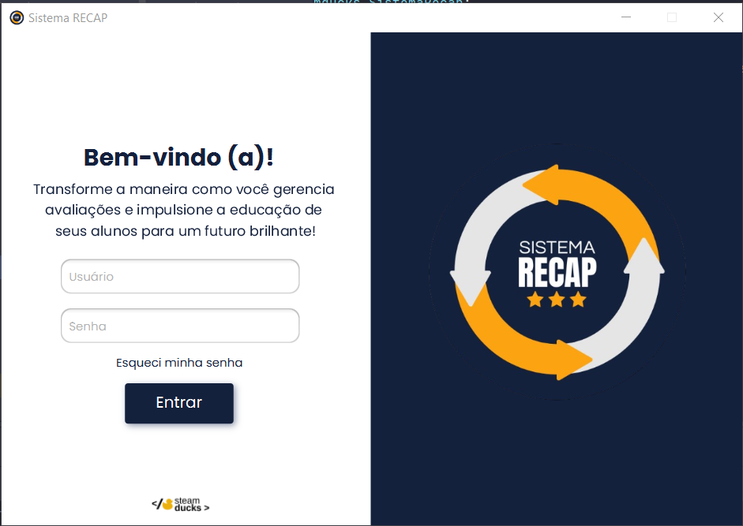
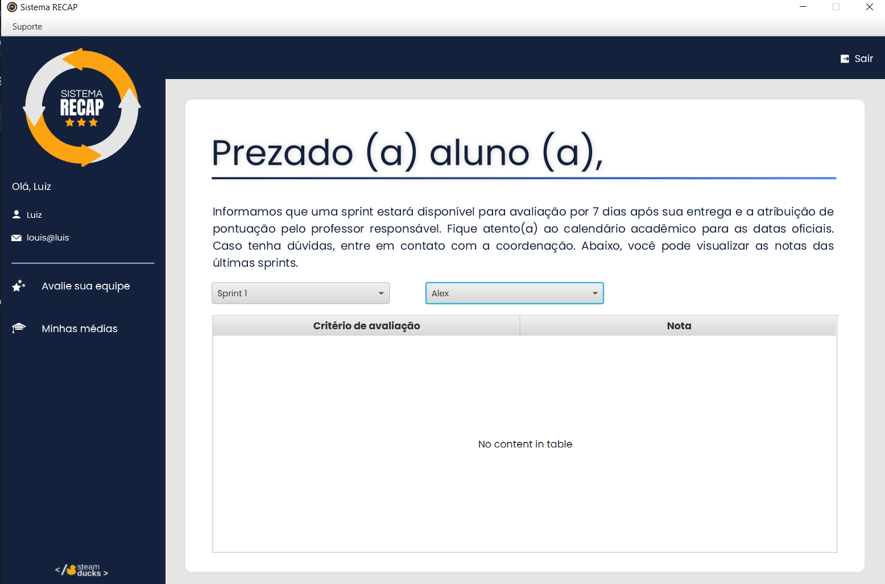
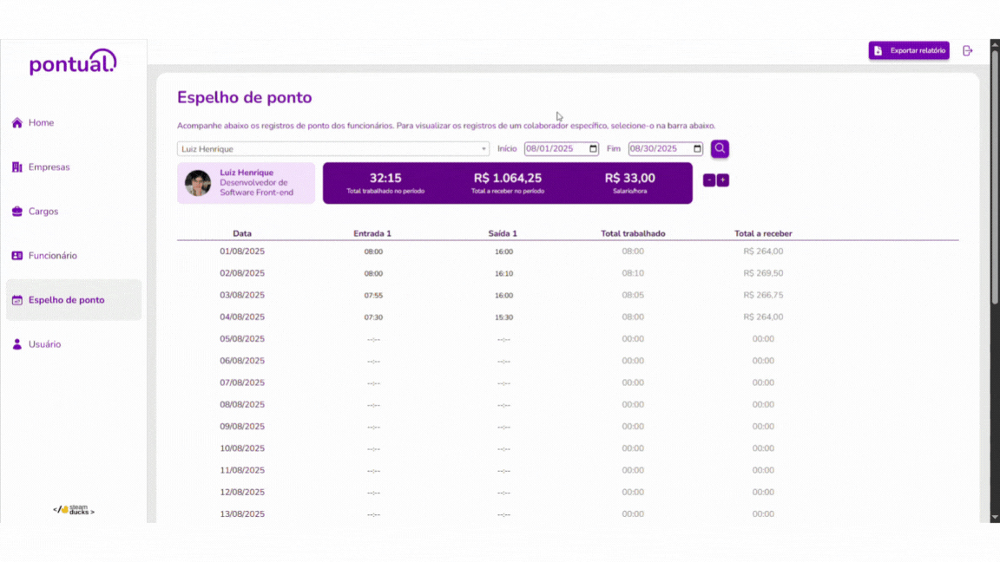
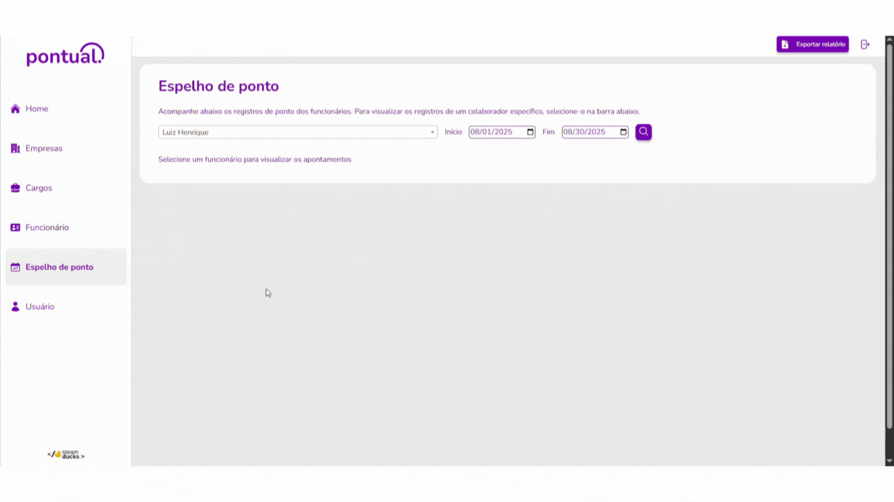

# Carlos Daniel Alves dos Santos

## Introdução
Desenvolvedor Full Stack na Pandô Apps, atualmente cursando Tecnólogo em Banco de Dados na
FATEC São José dos Campos. Tenho experiência em projetos utilizando Java, PHP,
Laravel, Spring Boot, Vue.js, PostgreSQL, MySQL e Oracle. Atuo com
foco em boas práticas de desenvolvimento, versionamento com Git/GitHub e qualidade
de código.

## Contatos

## Meus Principais Conhecimentos

- Desenvolvimento Back-End: Java (Spring Boot), PHP (Laravel), .NET/C#, autenticação JWT e construção de APIs RESTful.

- Banco de Dados: Modelagem e desenvolvimento com MySQL, PostgreSQL e Supabase.

- Desenvolvimento Front-End: Vue.js, JavaScript e TypeScript.

- Controle de Versão e Colaboração: Git e GitHub, integração em times ágeis com Scrum e Kanban.

- Boas Práticas: Testes (JUnit), qualidade de código, usabilidade, desempenho e escalabilidade.

- Ferramentas de Apoio: IntelliJ IDEA, Visual Studio, VS Code, MySQL Workbench, PgAdmin, DataGrip e Jira.

# Projetos

<strong>2024-1 (1º Semestre) — Calculadora Científica</strong>

 

Projeto desenvolvido em contexto acadêmico, com foco no aprendizado prático de programação e organização de software, atendendo a um cliente interno.
\
\
O objetivo do projeto foi construir uma aplicação em terminal capaz de executar operações matemáticas, conversões entre bases numéricas e cálculos complementares, como soma, subtração, multiplicação, divisão, fatorial, função de segundo grau, cálculo de juros e concatenação de strings.
\
\
O desenvolvimento foi dividido em sprints, com as primeiras entregas realizadas em VisualG e a evolução posterior para TypeScript, consolidando lógica de programação, modularização, versionamento e integração entre funcionalidades.

<table>
  <tr>
    <td></td>
    <td></td>
  </tr>
  <tr>
    <td></td>
    <td></td>
  </tr>
</table>

[REPOSITÓRIO](https://github.com/Steam-Ducks/scientific-calculator)

### Tecnologias Utilizadas

- **VisualG** - Linguagem utilizada nas primeiras sprints para construção da lógica das operações em pseudocódigo.
- **TypeScript** - Linguagem utilizada na evolução do projeto, introduzindo tipagem estática, modularização e práticas mais próximas do desenvolvimento real.
- **Git** - Ferramenta de controle de versão e colaboração em equipe, mantendo o histórico de alterações do código.
- **GitHub** - Plataforma onde o repositório do projeto foi hospedado.

### Contribuições Pessoais

**Lógica das Operações :**

Contribuí com a implementação e organização das funcionalidades centrais da calculadora, com foco nas operações matemáticas e na consolidação do menu principal. As principais entregas foram:

- Implementação da função de segundo grau (cálculo das raízes), inicialmente em VisualG e posteriormente migrada para TypeScript na evolução do projeto.

- Ajustes na lógica das operações básicas (soma, subtração, multiplicação e divisão), incluindo o desenvolvimento de uma função de acumulação que permitia executar operações sucessivas com mais de dois valores.

- Estruturação do menu principal da calculadora, organizando o fluxo de seleção das operações e a limpeza do terminal após cada execução para melhorar a experiência de uso.

**Refatoração e Robustez :**

- Refatorações sucessivas no código para extrair rotinas reutilizáveis, deixar a base mais limpa e facilitar a integração com as funcionalidades desenvolvidas pelo restante do time.

- Tratamento de entradas inválidas e correções pontuais (caracteres incorretos, valores fora do esperado) para deixar a aplicação mais robusta no uso em terminal.

**Versionamento :**

- Versionamento das próprias entregas no repositório do projeto, com commits descritivos e organização do fluxo de alterações, contribuindo para o histórico colaborativo do time.

### Hard Skills

- **VisualG** - Construção da lógica das primeiras versões da calculadora em pseudocódigo, exercitando estruturas condicionais, laços de repetição, declaração de variáveis e organização do fluxo de operações em uma aplicação de terminal. Foi a base para consolidar os conceitos fundamentais de lógica de programação aplicados ao longo do projeto.

- **TypeScript** - Migração da aplicação para uma linguagem com tipagem estática, com prática de modularização do código, criação de funções, manipulação de strings e validação de entradas do usuário. Primeiro contato com práticas mais próximas do desenvolvimento real, como organização de arquivos, composição de funcionalidades e tratamento de erros em uma aplicação de terminal.

- **Git** - Utilização do controle de versão para registrar a evolução do projeto ao longo das sprints, com prática de commits descritivos, criação de branches e integração das alterações entre os integrantes da equipe.

- **GitHub** - Hospedagem do repositório do projeto, acompanhamento do histórico de alterações e organização da colaboração entre os integrantes da equipe ao longo do semestre.

### Soft Skills

- _A definir._

<strong>2024-2 (2º Semestre) — PACER Assessment System</strong>

 

Projeto desenvolvido em contexto acadêmico, com o objetivo de tornar o processo de avaliação de equipes mais estruturado, transparente e organizado.
\
\
A solução consiste em um sistema desktop que permite a avaliação de integrantes de grupo a partir de critérios previamente definidos pelo administrador, contemplando autenticação de usuários, gerenciamento de grupos, definição de critérios de avaliação, cadastro de sprints e geração de relatórios.
\
\
Além da implementação, o projeto envolveu uma etapa importante de modelagem de dados e documentação, garantindo que a solução estivesse bem definida tanto do ponto de vista funcional quanto estrutural.

<table>
  <tr>
    <td></td>
    <td></td>
  </tr>
</table>

[REPOSITÓRIO](https://github.com/Steam-Ducks/pacer-assessment-system)

### Tecnologias Utilizadas

- **Java** - Linguagem utilizada no desenvolvimento da aplicação desktop, sem o uso de frameworks.
- **MySQL** - SGBD utilizado para persistência dos dados do sistema (usuários, grupos, critérios, sprints e relatórios).
- **MySQL Workbench** - Ferramenta utilizada para a modelagem do banco de dados e administração das instâncias.
- **Git** - Ferramenta de controle de versão e colaboração em equipe, mantendo o histórico de alterações do código.
- **GitHub** - Plataforma onde o repositório do projeto foi hospedado.

### Contribuições Pessoais

**Front-end (JavaFX / FXML) :**

Contribuí com o desenvolvimento das telas da aplicação desktop, especialmente nas funcionalidades ligadas à avaliação de sprints e ao gerenciamento de times:

- Criação das telas de avaliação e pontuação de sprints utilizando FXML, integradas ao menu principal da aplicação.

- Implementação do limitador de pontuação (point limit) com indicação visual ao usuário (professor) durante a avaliação dos integrantes da equipe.

- Construção das telas de filtro de times por semestre e gerenciamento de tarefas (tasks).

- Ajuste da função `loadView` para a navegação entre telas e correção do botão de logout.

- Correção da exibição em tabela e do botão de exclusão na listagem de sprints.

**Banco de Dados :**

Atuei na conexão entre as telas e o banco de dados MySQL, implementando os DAOs responsáveis pela persistência das diferentes entidades:

- Implementação da `SprintDAO` e integração com a tela de critérios (`CriteriosDAO`), conectando os formulários ao banco.

- Lógica de conexão para o limitador de pontos, garantindo que os totais respeitassem o ciclo de cada sprint.

- Integração da tabela de semestres com o componente de pontuação por sprint, permitindo o filtro correto dos dados conforme o período avaliado.

- Adição do arquivo de banco de dados ao projeto, formalizando a base utilizada pela aplicação.

**Gestão de Times :**

- Desenvolvimento das funções de remover aluno de um time e trocar aluno entre times, com persistência das alterações no banco.

- Correção da função de atualização de times (`update team`) e ajuste da consistência das datas de início e término das sprints.

**Padronização e Versionamento :**

- Renomeação de classes seguindo a padronização adotada pelo time (ex.: `notaSprint.java` → `NotaSprint.java`, `telaSprintController.java` → `TelaSprintController.java`).

- Resolução de conflitos de merge ao integrar as contribuições no repositório.

- Manutenção da documentação do projeto através da atualização do README.

### Hard Skills

- **Java** - Desenvolvimento de uma aplicação desktop sem o uso de frameworks, aplicando os princípios da Programação Orientada a Objetos (POO) na construção dos módulos do sistema. Estruturação de classes, encapsulamento, herança e polimorfismo na modelagem das entidades como Usuários, Grupos, Critérios e Sprints, além do tratamento de exceções e organização do fluxo de telas e regras de negócio.

- **MySQL** - Persistência dos dados do sistema com modelagem relacional das entidades de usuários, grupos, critérios de avaliação, sprints e relatórios. Escrita de consultas SQL para suportar as funcionalidades de cadastro, listagem, edição e geração dos relatórios consumidos pela aplicação.

- **MySQL Workbench** - Modelagem do banco de dados e criação do diagrama Entidade-Relacionamento (ER) representando as entidades e seus relacionamentos. Administração das instâncias do banco durante o desenvolvimento, com geração de scripts SQL e validação dos relacionamentos entre tabelas.

- **Git** - Versionamento do código ao longo das sprints, com prática de commits descritivos, criação de branches por funcionalidade e integração das contribuições do time, mantendo o histórico de alterações organizado.

- **GitHub** - Hospedagem do repositório do projeto, organização da documentação e acompanhamento da evolução das entregas ao longo do semestre, servindo como base para a colaboração e apresentação dos artefatos do produto.

### Soft Skills

- _A definir._

<strong>2025-1 (3º Semestre) —  Pontual.</strong>

 

Projeto desenvolvido para empresa parceira Altave, empresa com foco em monitoramento inteligente de grandes áreas através de videomonitoramento e inteligência artificial.
\
\
O objetivo do projeto foi criar uma aplicação web que permita o monitoramento de funcionários de empresas terceiras em uma determinada área de manutenção.
\
\
Foi entregue um sistema completo com capacidade de gerenciar os funcionarios cadastrados, as empresas, os usarios do sistema e os registros de ponto dos funcionarios, além da funcionalidade de exportar relatorios.

<table>
  <tr>
    <td></td>
    <td></td>
  </tr>
  <tr>
    <td></td>
    <td></td>
  </tr>
</table>

[REPOSITÓRIO](https://github.com/Steam-Ducks/point-system) 

### Tecnologias Utilizadas

- **Java** - Linguagem utilizada para o desenvolvimento do back-end do projeto.
- **SpringBoot** - Framework Java utilizado para a construção do back-end da aplicação Web
- **Vue.Js** - Framework utilizado para o desenvolvimento da interface do sistema.
- **PostgreSQL** - SGBD utilizado para gerenciar o banco de dados
- **Supabase** - Serviço de nuvem utilizado para hospedar o banco de dados
- **Figma** - Utilizado na etapa de design para prototipagem e validação das telas.
- **Git** - Ferramenta de controle de versão e colaboração em equipe, mantendo o histórico de alterações do código.
- **GitHub** - Plataforma onde o repositório do projeto foi hospedado.

### Contribuições Pessoais

**Banco de Dados :**

Fui responsável por toda a modelagem e estruturação do banco de dados, abrangendo:

- Criação do modelo conceitual e do modelo Entidade-Relacionamento (ER) para representar de forma clara as entidades do sistema — como Funcionários, Empresas, Cargos e Registros de Ponto — seus atributos e relacionamentos.

- Implementação do esquema físico do banco de dados, definindo tabelas, chaves primárias e estrangeiras, e restrições de integridade necessárias para suportar as User Stories do projeto.

- Manutenção evolutiva do banco, incluindo alterações estruturais (adição, remoção e modificação de colunas e relacionamentos) conforme novas demandas surgiam ao longo das sprints.

- Garantia da consistência e normalização dos dados, assegurando desempenho adequado para as operações do sistema.

**Documentação :**

Atuei como Product Owner ao longo do desenvolvimento, sendo o principal ponto de contato entre a equipe técnica e o cliente. Minhas responsabilidades incluíram:

- Elaboração da documentação completa da API REST utilizando Swagger, descrevendo os endpoints, parâmetros, respostas e códigos de status para facilitar a integração e o entendimento da equipe.

- Levantamento e refinamento de requisitos junto ao cliente, convertendo necessidades de negócio em User Stories claras e priorizadas, como adicionar empresas e adicionar funcionários.

- Criação e manutenção do Backlog do Produto, com definição dos critérios de DoD (Definition of Done) e DoR (Definition of Ready) para padronizar as entregas.

- Acompanhamento das sprints, ajudando a equipe a compreender o escopo e os objetivos de cada ciclo.

**Front-end :**

Contribuí para o desenvolvimento e manutenção das interfaces administrativas do sistema, com foco na experiência do usuário e integração com a camada de negócios. As principais entregas foram:

- Criação das telas de Gerenciamento de Cargos e Gerenciamento de Empresas, incluindo funcionalidades de listagem, edição e exclusão de registros.

- Correção do bug de edição de cargos, garantindo que a edição funcionasse corretamente em qualquer página da lista paginada, e não apenas na primeira.

- Revisão de código front-end ao final das sprints, avaliando qualidade, padrões visuais e consistência entre os módulos da aplicação antes das entregas.

- Desenvolvimento de modais de cadastro com tratamento de validações e feedbacks visuais ao usuário.

- Integração com o back-end através de requisições assíncronas (API REST) para manipulação dos dados.

**Back-end :**

No back-end, concentrei meus esforços na implementação das funcionalidades centrais do sistema. As principais atividades realizadas foram:

- Desenvolvimento dos módulos de cadastro de empresas e de funcionários, permitindo ao gestor de contratos vincular funcionários a empresas e controlar seus horários de trabalho.

- Implementação do módulo de registro de ponto, abrangendo toda a lógica de armazenamento, validação e regras de negócio.

- Implementação de testes unitários utilizando JUnit, cobrindo as classes de Service e Controller para garantir o correto funcionamento das funcionalidades isoladas.

- Criação de testes de integração para as camadas de Repository e Service, validando a comunicação entre as diferentes partes do sistema.

- Otimização de consultas e melhorias de performance em trechos críticos do código.

**Versionamento :**

Fui responsável pela organização e manutenção do repositório do projeto no GitHub, garantindo boas práticas de versionamento e integração contínua.

- Configuração do `.gitignore` do projeto, assegurando que arquivos desnecessários (builds, dependências, configs locais) não fossem versionados.

- Gerenciamento de branches, adotando fluxos de trabalho padronizados (feature branches, hotfix, release).

- Revisão de Pull Requests e code review ao final das sprints, assegurando a qualidade do código antes da integração na branch principal.

- Resolução de conflitos e controle de versões para evitar retrabalho e perda de histórico.

### Hard Skills

- **Vue.JS** - Desenvolvimento de componentes reutilizáveis e correção de bugs em interfaces existentes, como a correção da edição de cargos em listas paginadas. Realizei code review no front-end ao final das sprints, garantindo padronização visual e consistência entre os módulos. Experiência na integração com APIs REST e uso de reatividade para otimizar a experiência do usuário.

- **Java** - Aplicação dos princípios da Programação Orientada a Objetos (POO) na construção dos módulos de cadastro de empresas e funcionários. Desenvolvimento de código limpo e estruturado com foco em boas práticas, padronização de arquitetura e facilidade de manutenção.

- **SpringBoot** - Criação de APIs RESTful completas para os módulos de empresas e funcionários, desde o mapeamento de entidades até as camadas Controller, Service e Repository. Documentação dos endpoints da API utilizando Swagger. Configuração de testes automatizados com JUnit e integração com o banco de dados via JPA/Hibernate.

- **SQL** - Criação do modelo conceitual do banco de dados, definindo entidades como Funcionários, Empresas, Cargos e Registros de Ponto. Implementação do esquema físico em PostgreSQL hospedado no Supabase, com scripts de criação de tabelas, chaves e restrições de integridade. Execução de consultas otimizadas e ajustes nos relacionamentos conforme a evolução do projeto.

- **Git** - Configuração do `.gitignore` do projeto e gerenciamento completo do versionamento, utilizando submódulos para separar back-end e front-end. Revisão de Pull Requests, resolução de conflitos de merge e padronização de commits, adotando um fluxo colaborativo com branches organizadas (main, develop, feature, hotfix).

### Soft Skills

- **Comunicação** - Exercitada na tradução das User Stories em requisitos técnicos claros para a equipe, e na documentação da API no Swagger, que serviu como ponte de entendimento entre front-end e back-end. Atuei como elo entre cliente e equipe, garantindo alinhamento de escopo e prioridades.

- **Trabalho em equipe** - Evidenciado nas revisões de código front-end ao final das sprints , onde colaborei com os colegas para manter a qualidade e a consistência do projeto. Compartilhei conhecimento técnico e contribuí para a resolução de problemas de forma cooperativa.

- **Priorização de Tarefas** - Experiência na organização do Backlog, priorizando tarefas como o modelo conceitual do banco e a configuração do gitignore antes das entregas, e identificando correções urgentes como o bug de edição de cargos. Capacidade de avaliar impacto e valor de negócio para definir a sequência de execução.

- **Gestão de Pessoas** - Apoiei o time na distribuição de tarefas a partir das User Stories, acompanhando o progresso e garantindo que as entregas estivessem alinhadas com os critérios de DoD e DoR. Promovi um ambiente colaborativo orientado a resultados, favorecendo produtividade e engajamento.

<strong>2025-2 (4º Semestre) — Tráfegou!</strong>

 

Projeto full stack desenvolvido para apoiar o monitoramento contínuo da mobilidade urbana, consolidando indicadores de tráfego por região e auxiliando a tomada de decisão sobre ações em campo.
\
\
O sistema atribui níveis de monitoramento às regiões, gera alertas automáticos a partir dos indicadores e registra protocolos de ação, contando com mapas interativos, dashboards, autenticação de usuários e processamento contínuo de dados.
\
\
Foi entregue uma aplicação web completa, com gestão de usuários e cargos, controle de acesso, ingestão e tratamento dos dados de velocidade, cálculo de indicadores regionais e visualização dos resultados em painéis interativos.

<table>
  <tr>
    <td></td>
    <td></td>
  </tr>
  <tr>
    <td></td>
    <td></td>
  </tr>
</table>

[REPOSITÓRIO](https://github.com/Steam-Ducks/traffic-monitoring-system)

### Tecnologias Utilizadas

- **Java 17** - Linguagem utilizada no desenvolvimento do back-end da aplicação.
- **SpringBoot** - Framework Java utilizado para a construção da API REST e da camada de segurança do back-end.
- **Vue.js 3** - Framework utilizado no desenvolvimento da interface da aplicação web.
- **TypeScript** - Linguagem utilizada no front-end para tipagem estática e organização do código.
- **Oracle** - SGBD utilizado para persistência de usuários, indicadores, regiões, níveis e protocolos.
- **Docker** - Utilizado para padronizar a build e o ambiente de execução do back-end.
- **Telegram Bot API** - Utilizada para integrar o sistema a um bot do Telegram, viabilizando o envio de notificações e o fluxo de vinculação de usuários.
- **Git** - Ferramenta de controle de versão e colaboração em equipe, mantendo o histórico de alterações do código.
- **GitHub** - Plataforma onde o repositório do projeto foi hospedado.

### Contribuições Pessoais

**Back-end (Java / Spring Boot) :**

Atuei no desenvolvimento de funcionalidades centrais do sistema, com foco em integração de dados regionais, indicadores e endpoints da API. As principais entregas foram:

- Configuração inicial da build do projeto com Docker, padronizando o ambiente de execução do back-end.

- Correção da conexão com o banco de dados e do mapeamento das entidades, eliminando inconsistências na criação dos `region_indicators`.

- Implementação da função `get_region_by_point` no repositório, permitindo identificar a região correspondente a um ponto geográfico — utilizada na validação das câmeras associadas a cada região.

- Desenvolvimento do endpoint de nível por cidade (`city level`), incluindo o ajuste dos parâmetros corretos no controller responsável.

- Implementação do endpoint de nível por indicador, com correção da descrição associada para garantir a exibição correta no front-end.

- Limpeza do repositório com a remoção de pastas e arquivos não versionados (`idea`, `build`), reduzindo ruído no histórico.

**Integração com Telegram Bot :**

Fui responsável pela construção da integração do sistema com um bot do Telegram, permitindo que usuários se vinculassem ao sistema e recebessem informações relacionadas aos níveis de tráfego. As entregas foram:

- Configuração inicial do bot do Telegram, incluindo as integrações necessárias para comunicação com a API.

- Implementação do webhook responsável por receber as mensagens do bot e disparar as ações no back-end.

- Desenvolvimento da função de envio de mensagens do bot, viabilizando o disparo de alertas e notificações aos usuários.

- Implementação do método de registro de usuários via bot, conectando o usuário do sistema ao seu identificador no Telegram.

- Implementação das funções de geração de código de validação (Telegram code generator) usadas no fluxo de vinculação entre o usuário do sistema e o seu Telegram.

**Front-end (Vue.js 3 / TypeScript) :**

Contribuí com componentes do dashboard ligados aos indicadores e à integração com o bot:

- Adição de novos componentes ao board principal e exibição do status do indicador diretamente nos cards.

- Conexão dos componentes do dashboard com o back-end, ajustando o fluxo de consumo das APIs e o comportamento dos elementos da interface.

- Desenvolvimento do componente de geração do ID do Telegram, utilizado pelo usuário no processo de vinculação com o bot.

**Versionamento :**

- Versionamento das próprias entregas nos repositórios `tms-server` e `tms-client`, com commits descritivos e rastreáveis aos cards do Jira (TMS-XX), facilitando a integração contínua e o acompanhamento das tarefas ao longo das sprints.

### Hard Skills

- **Java 17** - Desenvolvimento de funcionalidades do back-end aplicando os princípios da Programação Orientada a Objetos (POO), com estruturação de classes, organização em camadas (Controller, Service, Repository) e tratamento de exceções nas correções de mapeamento das entidades e na criação dos `region_indicators`.

- **SpringBoot** - Construção de endpoints da API REST utilizando a stack do Spring (Controller, Service, Repository), incluindo o endpoint de nível por cidade (`city level`), o endpoint de nível por indicador, o ajuste dos parâmetros nos controllers e o mapeamento da função `get_region_by_point` para identificar a região a partir de um ponto geográfico. Integração com o banco de dados via JPA/Hibernate.

- **Vue.js 3** - Desenvolvimento de componentes do dashboard utilizando a Composition API, com a adição de novos componentes ao board, exibição do status do indicador diretamente nos cards e construção do componente de geração do ID do Telegram, utilizado no fluxo de vinculação do usuário com o bot.

- **TypeScript** - Aplicação de tipagem estática no front-end para garantir consistência dos dados consumidos da API ao conectar os componentes do dashboard ao back-end, com definição de interfaces e contratos nos serviços de comunicação entre as camadas.

- **SQL / Oracle** - Persistência e consulta dos dados de regiões, câmeras, indicadores e níveis, com correção do mapeamento das entidades, ajuste das queries que sustentam os endpoints de `city level` e `indicator level` e implementação da consulta `get_region_by_point` no repositório, suportando a validação de câmeras por região.

- **Docker** - Configuração inicial da build do back-end com Docker, padronizando o ambiente de execução e facilitando a reprodutibilidade entre os integrantes do time.

- **Telegram Bot API** - Integração completa do sistema a um bot do Telegram: configuração inicial do bot, webhook para recebimento de mensagens, função de envio de mensagens, método de registro de usuários via bot e geração de código de validação no fluxo de vinculação entre o usuário do sistema e o seu Telegram.

- **Git** - Versionamento das entregas nos repositórios `tms-server` e `tms-client`, com branches por funcionalidade e commits descritivos rastreáveis aos cards do Jira (TMS-XX), facilitando o acompanhamento das tarefas ao longo das sprints.

- **GitHub** - Hospedagem dos submódulos do projeto, gestão das Pull Requests e acompanhamento do histórico de alterações ao longo do semestre.

### Soft Skills

- _A definir._

